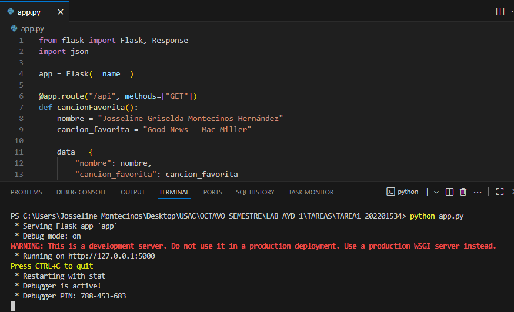

# TAREA 1

Fecha: 11/08/2025

### Nombre: Josseline Griselda Montecinos Hernández
Registro Académico: 202201534

---

# Funcionalidad de la API (flask + Python)

## Código

```python
from flask import Flask, Response
import json

app = Flask(__name__)

@app.route("/api", methods=["GET"])
def cancionFavorita():
    nombre = "Josseline Griselda Montecinos Hernández"
    cancion_favorita = "Good News - Mac Miller"

    data = {
        "nombre": nombre,
        "cancion_favorita": cancion_favorita
    }

    return Response(
        json.dumps(data, ensure_ascii=False),  
        content_type="application/json; charset=utf-8"
    )

if __name__ == "__main__":
    app.run(debug=True)

```

## Levantar API



## Visualización del endpoint


# Tag Versión Inicial

## GitKraken


## Github


# Rama Hotfix


# Tag Versión Corregida

## GitKraken


## Github


# Eliminar la rama hotfix


